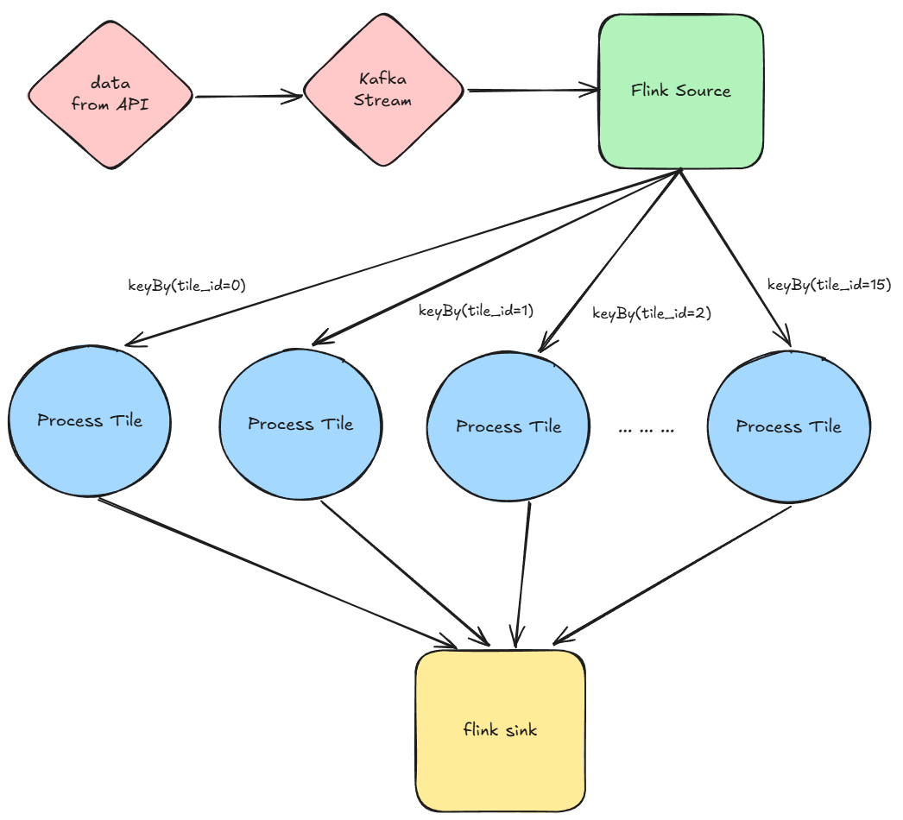
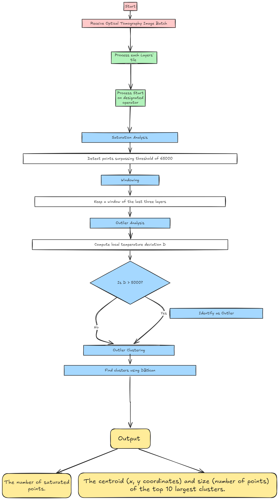

# CS551 Design Document

Authors: Jingzhi Yan, Xinny Lao, Zishuo Liu

# Project Statement

The current method of detecting errors during manufacturing using Laser Powder Bed Fusion (L-PBF) occurs after the object is fully created. However, this approach has high costs of money and time when errors occur, since the entire object is already created but cannot be accepted. This manufacturing technique is commonly used in industries such as aerospace and automotive due to its advantage in producing complex objects with high precision. Depending on the failure rate of this method, the total cost of reproducing all failed objects may be very costly. By addressing this problem, manufacturing plants in these industries can benefit from reduced production costs, which can be significant with large manufacturing projects. The current naive Python solution has high latency and lacks horizontal scalability. This presents a problem because real-time manufacturing defects should be detected quickly in order to minimize material waste. 

# Proposed Solution

Our proposed solution is to implement a distributed streaming system using Apache Flink and Apache Kafka. This is our system optimization. 

**Request Batches**

* Create new bench specifying maximum number of batches to process  
* Request batches of data by using /api/next\_batch/

**Processing**

* Each batch contains a 2D image (tif format). tile\_id and print\_id identify the region of the image. Therefore, to enable parallelism, we want to key by tile\_id so that each partition is responsible for each region.  
* On receival of 1 tile, sort by tile number using Flink’s keyBy() method.  
  * parallelize processing of the tiles   
  * number of operators should be equal to the range of tile numbers (through testing the naive Python solution, it seems that each layer has a fixed size of 16 tiles)  
* Outlier neighbors counting: Here, we need to maintain a sliding window of 3 layers for each tile region. We will maintain a FIFO queue type data structure specific to each operator state. The max size of the queue is 3, and if the number of layers exceeds 3, the oldest layer is removed from the queue. As of right now, we will maintain memory of the entire tile section of up to three layers in their respective keyBy operators, but we may perform aggregation of previous tiles later if we come up with ways that don't sacrifice accuracy.  
* Within each partition, for the newly arrived tile image, we need to count pixels exceeding the saturation threshold by iterating over them.

**Outlier Detection**  
Policy 1: basic approach

* Since each region window contains 3 layers, we can stack all layers into a 2d matrix.  
* For each point x in the matrix, we skip empty or saturated points, and compute deviations between x and close / outer neighbors.  
* If deviation is larger than threshold, we mark this pixel as outlier.

Policy 2: incremental updates

* The problem with policy 1 is that the transition from one window to the next (e.g., \[0,1,2\] → \[1,2,3\]) results in significant redundant computations such as recalculating deviations in layer 1 and 2\.  
* Instead of recomputing all deviations, we can store the previous results and only update what changed. We can keep track of the deviation values computed for each point in the last window and only recompute deviations for pixels affected by the newly added layer. Therefore, we need to find a way to efficiently remove the effect of the old layer and add the new layer.  
* For each point, keep an array of close neighbor temps and outer neighbor temps, which may change depending on window number.

Policy 3: parallelism within each tile

* One possible optimization is that we can enable two or more threads working within one tile for faster computation speed. This can be done by separating the tile into two or more sub-tiles so that each thread can work on a specific sub-tile to calculate outliers. This may require thread access to pixels from other sub-tiles. Since all pixels can be read-only, multi-threading will not incur contention issues.

**Outlier Clustering**

* Clusters outliers using DBSCAN, grouping close points.  
* We may use [ELKI](https://elki-project.github.io/) DBSCAN to increase performance relative to traditional DBSCAN.

**Output**

- After identifying outlier clusters, each tile should output a result.  
- Move on to the next tile in the batch.  
- Request a new batch when necessary.

**Data Flow Diagram**  

**Logic Flow Diagram**  

# Expectations

The expected effects of the proposed solution will be to increase throughput and reduce the latency via utilizing distributed programming and more efficient algorithms in computing intermediate values. We will measure throughput/latency of both the Python solution and our Apache Flink/Kafka (Java) solution through Flink’s built in metrics. Our distributed version of the solution should not change the outlier or cluster results. In other words, we should only improve on efficiency without sacrificing accuracy. In terms of accuracy, we will give attention to the fault tolerance, point out which part will persist the disk.We will use built-in fault tolerance features from Flink and Kafka to maintain any important data structures (ex: windows stored on operator state). In the discussion, the problems we considered:  How can we recover the data from the log, or is it necessary to recover the data?

We considered using PyFlink and PyKafka to implement our solution. The advantage would be that we can directly improve upon the naive Python solution we were given. The disadvantage is that there are less community resources for using Flink and Kafka in Python. Additionally, we believe that using the Java version will result in lower latency than the Python version since the Python version needs to interact with the Java Virtual Machine. Additionally, Java is innately faster than Python at computing nested loops, which will be important when we calculate neighboring points. 

# Experimental Plan

We will use the latency of Policy 1 as a baseline solution and compare the running latency of policy 2 and 3 with the given naive python solution. We will perform the following experiments to compare:

1. Run with only policy 1\.  
2. Run with only policy 2\.  
3. Run with policy 2 & 3 enabled.  
4. Run with policy 1 & 3 enabled.

We are planning to use the datasets provided in the DEBS docs, which can be fetched via API requests. We will deploy our experiments on NERC and use Java’s builtin timer interface to record latency. We expect the latency of experiments to be ranked as: 1 \> 2 \> 4 \> 3, which will suggest policy 2 outweighs policy 1 and policy 3 can boost the performance, confirming our hypothesis.  
I don’t think we currently need any other additional resources other than cloud computing through NERC or SCC. 

# Success Indicators

The outcome of our project is an algorithm usable by manufacturing companies who use Laser Powder Bed Fusion such that they can detect defective objects as soon as possible. We will start with a baseline Flink/Kafka solution and aim to distribute our calculations horizontally to multiple operators. Then, we will try to optimize our calculations and processing methods for each operator. We know each milestone is complete when they can accurately process the input data and produce an expected output. Our measure of success is to build a more efficient and more scalable solution without sacrificing accuracy. If we achieve this through our tests, we will declare the project a success. 

# Task Assignment

Task 1: Baseline Implementation (Policy 1\)  
Goal: Implement the basic outlier detection approach, where each region window of 3 layers is fully recomputed in every step  
Dependencies: None (this is the baseline).  
Assigned To:   
Estimated Time: 3 days

Task 2: Incremental Update Optimization (Policy 2\)  
Goal: Implement incremental updates  
Dependencies: Task 1  
Assigned To:   
Estimated Time: 1-2 week

Task 3: Multi-Threaded Parallelism per Tile (Policy 3\)  
Goal: Multi-threading  
Dependencies: Task 1  
Assigned To: Kelly  
Estimated Time: 1-2 week

Task 4: Experiment Setup & Data Collection  
Goal: Run and compare latency for different policies on NERC  
Dependencies: Task 1  
Assigned To: All members  
Estimated Time: 1 week

Task 5: Report & Presentation  
Goal: Document findings, create a report, and prepare for presentation  
Dependencies: Task 5  
Assigned To: All members  
Estimated Time: 1 week

# Reference

[https://nightlies.apache.org/flink/flink-docs-release-1.20/docs/dev/datastream/operators/overview](https://nightlies.apache.org/flink/flink-docs-release-1.20/docs/dev/datastream/operators/overview)  
[https://elki-project.github.io/howto/clustering](https://elki-project.github.io/howto/clustering)  
[https://kafka.apache.org/documentation](https://kafka.apache.org/documentation)
